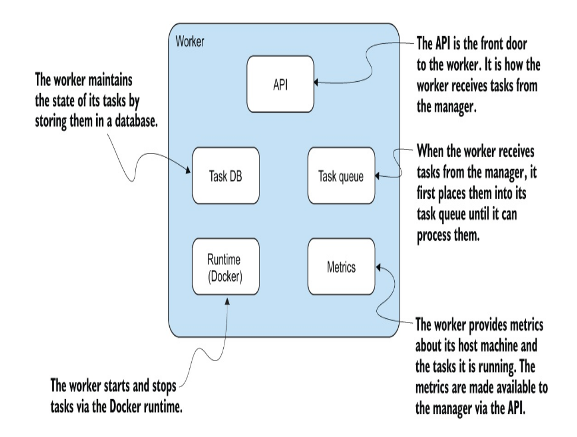
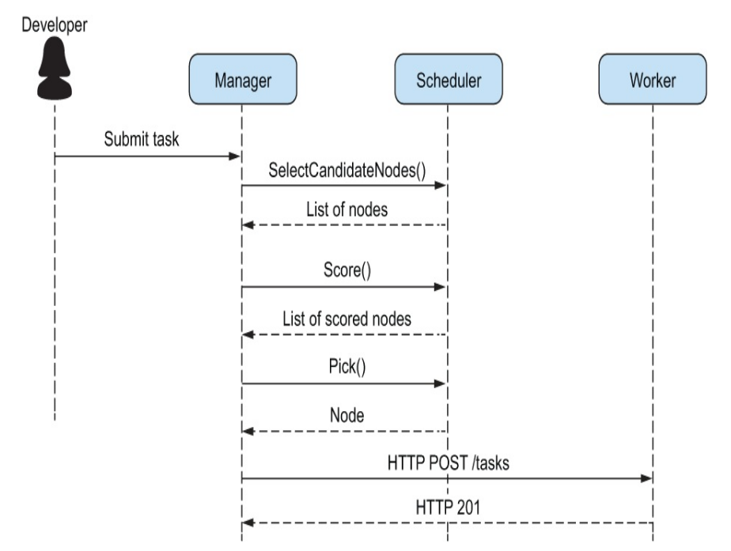
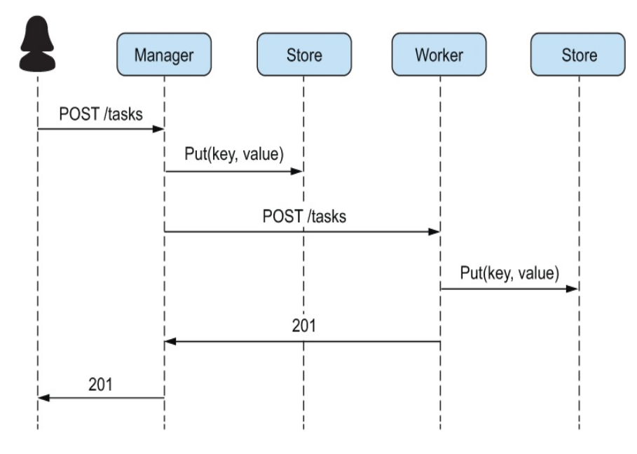
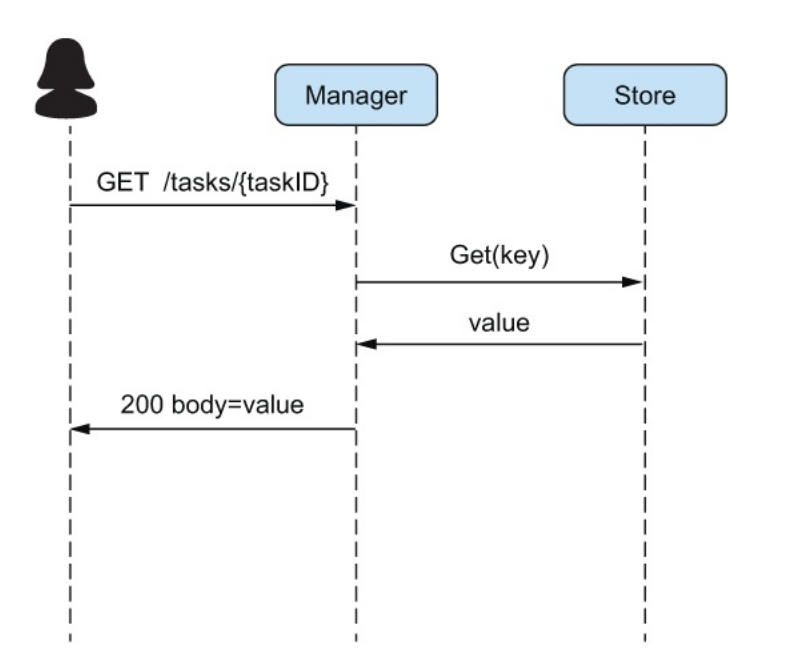

1. Skeleton code -> task, node, manager, worker, scheduler
2. Start with task -> states(pending, scheduled, running, failed, completed)

an ID to identify individual task.
Since we will be using docker images for our task, we can define Image, Memory, Disk, ExposedPorts, PortBindings and Restart Policy in Task struct.
Finally, to know when a task starts and stops, we can add StartTime
and FinishTime fields to our struct.
how does a user tell the system to stop a task? For this purpose, let’s introduce the TaskEvent struct.

3. Worker 
- Run tasks as Docker containers
- Accept tasks to run from a manager
- Provide relevant statistics to the manager for the purpose of scheduling tasks
- Keep track of its tasks and their state

4. Manager
- Accept requests from users to start and stop tasks
- Schedule tasks onto worker machines
- Keep track of tasks, their states, and the machine on which they run
######################################################################
- Responding to requests from users
- Scheduling tasks on workers
- Periodically collecting information about the state of tasks and workers in the system
- Checking the health of running tasks and attempting to get them into a healthy state when something goes wrong

5. Scheduler
- Determine a set of candidate workers on which a task could run
- Score the candidate workers from best to worst
- Pick the worker with the best score

6. Metrics to be exposed for manager to schedule the task.

- CPU usage (as a percentage)
- Total memory
- Available memory
- Total disk space
- Available disk space

The files in the /proc filesystem that we’re going to work with are as
follows:

- /proc/stat—Contains information about processes running on the system
- /proc/meminfo—Contains information about memory usage
- /proc/loadavg—Contains information about the system’s loadaverage
- These files are the source of data that you see in many Linux commands like ps, stat, and top.

Since, goprocInfo do not provide us way to calculate CPU percentage but only provides the struct of the states
where CPU was. We need to calculate it ourself.

        type CPUStat struct {
        Id
        string `json:"id"`
        User
        uint64 `json:"user"`
        Nice
        uint64 `json:"nice"`
        System
        uint64 `json:"system"`
        Idle
        uint64 `json:"idle"`
        IOWait
        uint64 `json:"iowait"`
        IRQ
        uint64 `json:"irq"`
        SoftIRQ
        uint64 `json:"softirq"`
        Steal
        uint64 `json:"steal"`
        Guest
        uint64 `json:"guest"`
        GuestNice uint64 `json:"guest_nice"`
        }

The general algorithm for performing this calculation is
1. Sum the values for the idle states.

2. Sum the values for the non-idle states.

3. Sum the total of idle and non-idle states.

4. Subtract the idle from the total and divide the result by the total.

https://stackoverflow.com/questions/23367857/accurate-calculation-of-cpu-usage-given-in-percentage-in-linux

### Manager API
- Send a task to the manager
- Get a list of tasks
- Stop a task

### What could possibly go wrong?
- Enumerating potential failures
- Exploring options for recovering from failures
- Implementing task health checks to recover from task crashes

### Implementing health checks
- An application implements a health check and exposes it on its APIas /health. (The name of the endpoint could be anything, as long
as it’s well defined and doesn’t change.)
- When a user submits a task, they define the health check endpoint
as part of the task configuration.
- The manager calls a task’s health check periodically and will attempt
to start a new task for any non-200 response.

### Scheduler

Sequence diagram showing the interactions between
the manager, scheduler, and worker

### Store

Put method

Get method
