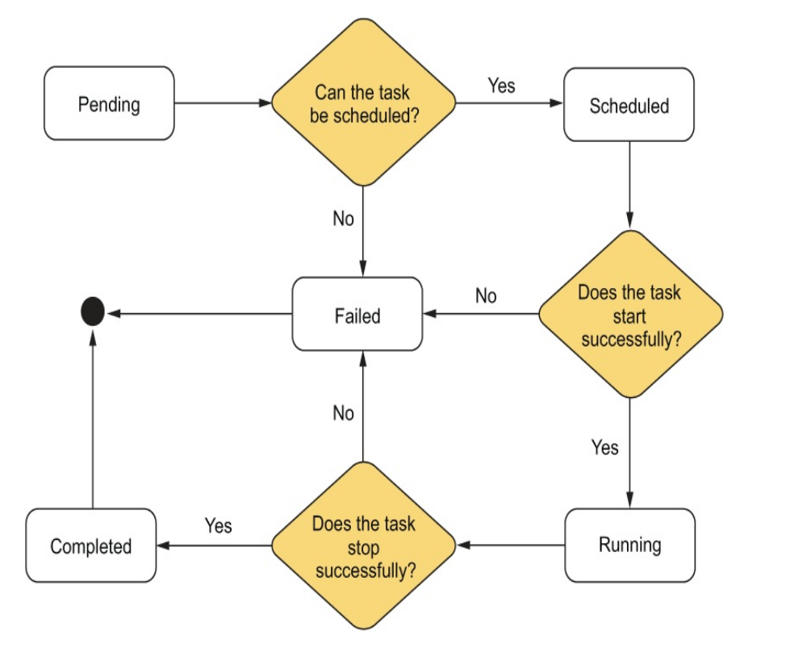
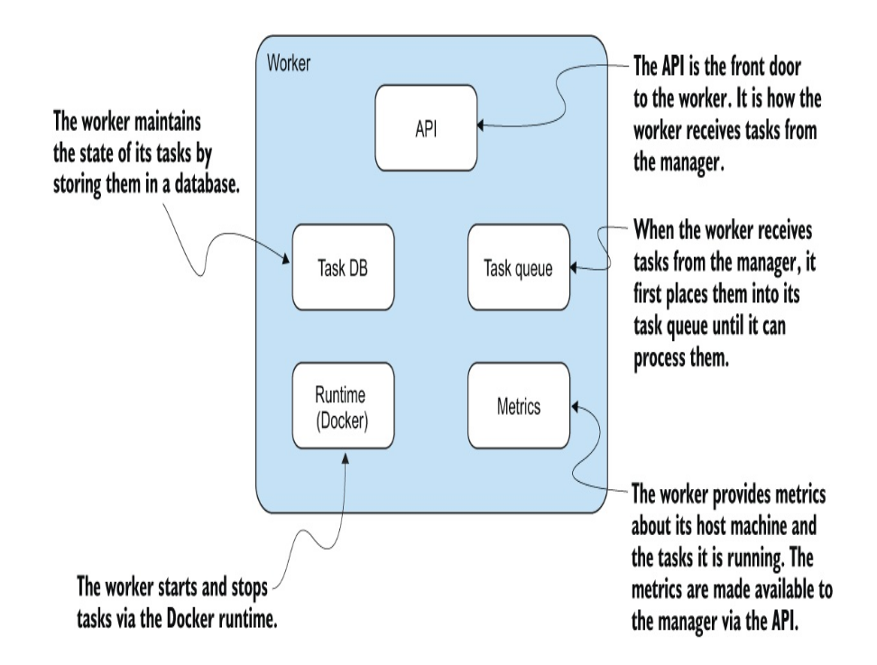
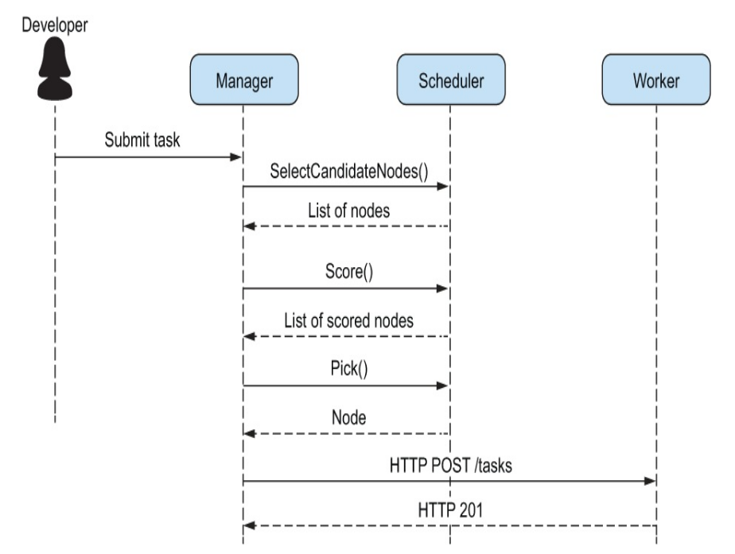
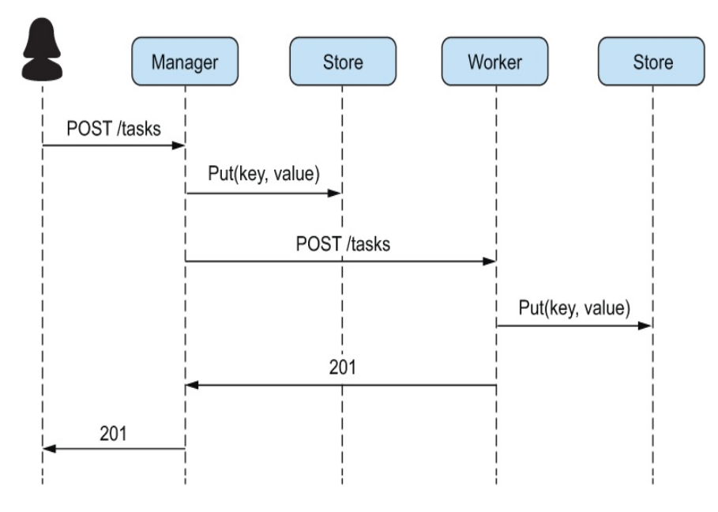
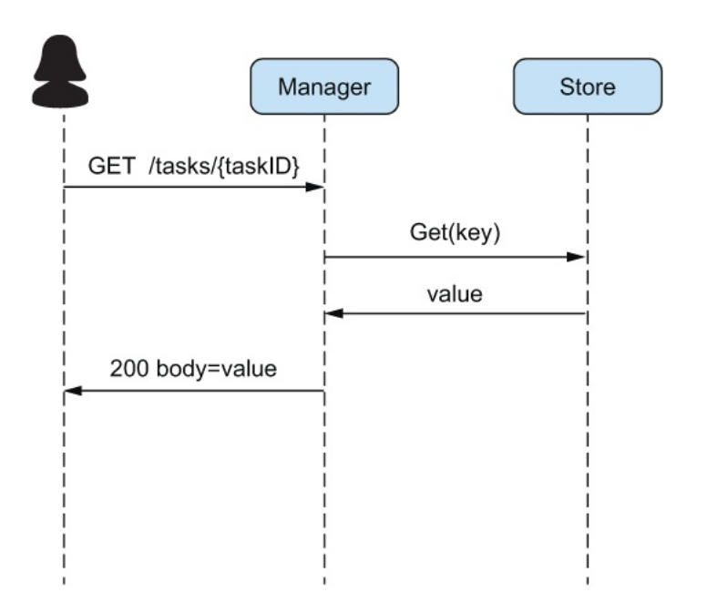
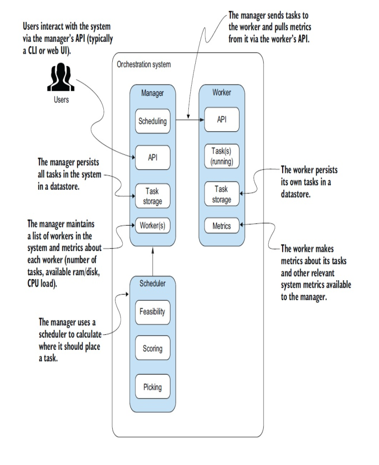

# my-orchestrator

## 1. Overview
This system consists of multiple components that work together to schedule and manage tasks using Docker containers. The core components are:
- **Task**
- **Worker**
- **Manager**
- **Scheduler**

## 2. Task
A **Task** goes through the following states:
- **Pending**
- **Scheduled**
- **Running**
- **Failed**
- **Completed**

Each task has:
- A unique **ID**
- **Docker Image**
- **Resource specifications**:
  - Memory
  - Disk
  - Exposed Ports
  - Port Bindings
  - Restart Policy
- **Timestamps**:
  - StartTime
  - FinishTime
- **TaskEvent Struct** to handle stop requests from users

## 3. Worker
Responsibilities:
- Run tasks as Docker containers
- Accept tasks from the manager
- Provide statistics for task scheduling
- Track task states

## 4. Manager
Responsibilities:
- Accept user requests to start and stop tasks
- Schedule tasks onto worker machines
- Maintain records of tasks, their states, and assigned machines
- Respond to user requests
- Periodically collect system metrics
- Monitor task health and recover failed tasks

## 5. Scheduler
Responsibilities:
- Identify candidate workers for task execution
- Score workers based on resource availability
- Assign tasks to the best-scoring worker

## 6. Metrics for Task Scheduling
The manager considers the following system metrics to schedule tasks:
- **CPU Usage (%)**
- **Total Memory**
- **Available Memory**
- **Total Disk Space**
- **Available Disk Space**

Metrics are gathered from:
- `/proc/stat` (process information)
- `/proc/meminfo` (memory usage)
- `/proc/loadavg` (system load average)

### CPU Usage Calculation Algorithm
1. Sum the idle state values.
2. Sum the non-idle state values.
3. Compute the total (idle + non-idle).
4. Compute CPU usage percentage:  
   `(total - idle) / total * 100`

## 7. Manager API
- **Send a task to the manager**
- **Retrieve a list of tasks**
- **Stop a task**

## 8. Handling Failures
### Potential Issues:
- Task failures
- Worker crashes
- Resource exhaustion

### Recovery Strategies:
- Implementing health checks
- Restarting failed tasks
- Rebalancing tasks across workers

### Health Checks Implementation:
1. Applications expose a health check endpoint (e.g., `/health`).
2. Users define the health check endpoint in task configurations.
3. The manager periodically calls the health check.
4. If a non-200 response is received, the manager attempts task recovery.

## 9. Storage System
### Put Method:
Stores task-related information.

### Get Method:
Retrieves task-related information.

## 10. Final Model
The following diagram illustrates the interaction between all components:

This document provides a structured approach to implementing a robust task management system with scheduling, monitoring, and recovery mechanisms.
