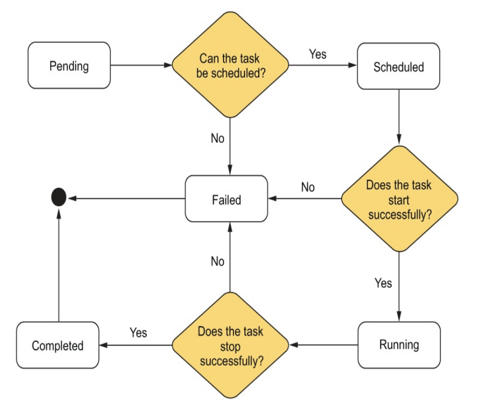

1. Skeleton code -> task, node, manager, worker, scheduler
2. Start with task -> states(pending, scheduled, running, failed, completed)

an ID to identify individual task.
Since we will be using docker images for our task, we can define Image, Memory, Disk, ExposedPorts, PortBindings and Restart Policy in Task struct.
Finally, to know when a task starts and stops, we can add StartTime
and FinishTime fields to our struct.
how does a user tell the system to stop a task? For this purpose, let’s introduce the TaskEvent struct.

3. Worker 
- Run tasks as Docker containers
- Accept tasks to run from a manager
- Provide relevant statistics to the manager for the purpose of scheduling tasks
- Keep track of its tasks and their state

4. Manager
- Accept requests from users to start and stop tasks
- Schedule tasks onto worker machines
- Keep track of tasks, their states, and the machine on which they run

5. Scheduler
- Determine a set of candidate workers on which a task could run
- Score the candidate workers from best to worst
- Pick the worker with the best score